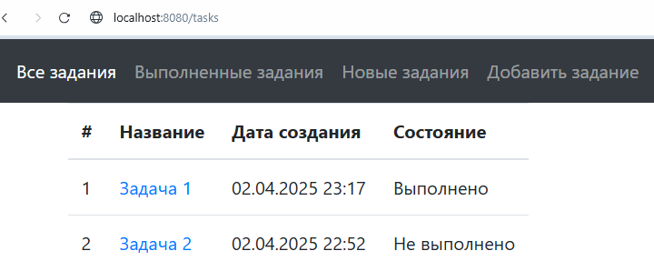
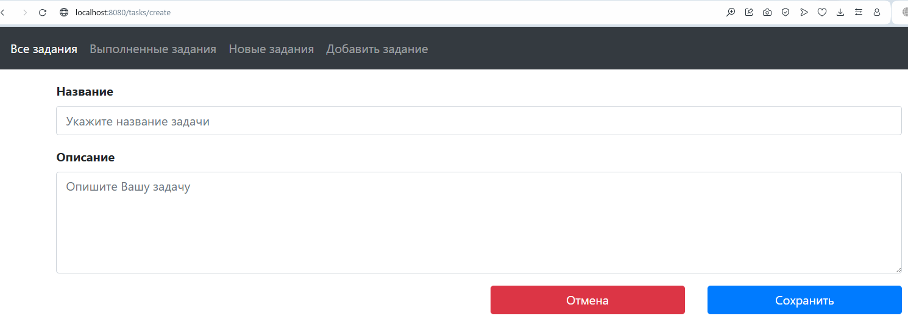
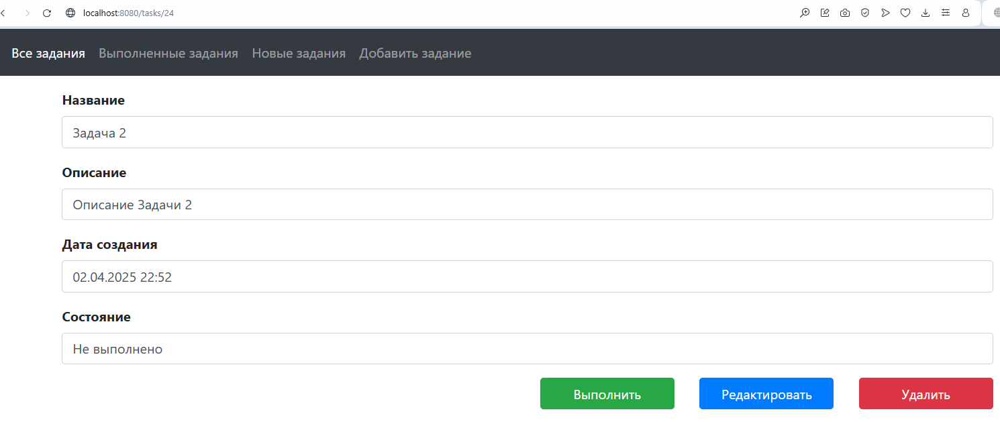
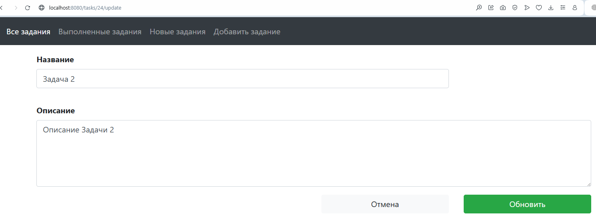

# "TODO список"
***
## Описание проекта "TODO список":
Данный проект - это веб-приложение, предоставляющее возможность управления списком заданий.

С его помощью можно добавлять, редактировать и удалять задания.

Включает страницы: список заданий, добавление задания, описание задания, редактирование задания.
***
## В данном проекте используются:
Java 17, Spring Boot 2.7.3, Thymeleaf 2.7.3,

Bootstrap 4.1.3, Liquibase 4.28.0, Hibernate 5.6.11,

Lombok 1.18.36, PostgreSQL 16
***
## Требования к окружению:
Java 17

Maven 3.10

PostgreSQL 16
***
## Запуск проекта:
1. Скачиваете проект из данного репозитория
2. Создаете базу данных с именем "todo"
3. Указываете имя пользователя и пароль для базы данных в файлах:
   liquibase.properties и hibernate.cfg.xml
4. Запускаете Liquibase: liquibase:update (либо maven install)
5. Запускаете приложение в классе Job4jTodoApplication
6. Открываете ссылку http://localhost:8080/tasks
***
## Интерфейс:

### Главная страница

Приложение имеет четыре раздела:

"Все задания" - перечислены все задания, в том числе выполненные.

"Выполненные задания"

"Новые задания"

"Добавить задание"

### Добавить задание

Здесь можно ввести имя и описание задания. А так же сохранить или отменить создание.

### Описание задания

Имя каждого задания - это ссылка на страницу с ее описанием

Данная страница содержит описание задания, а также кнопки: выполнить, редактировать, удалить

### Редактирование задания

На данную страницу ведет кнопка "Редактировать"

Данная страница содержит название и описание задания, а также кнопки: отмена и обновить

***
job4j_todo